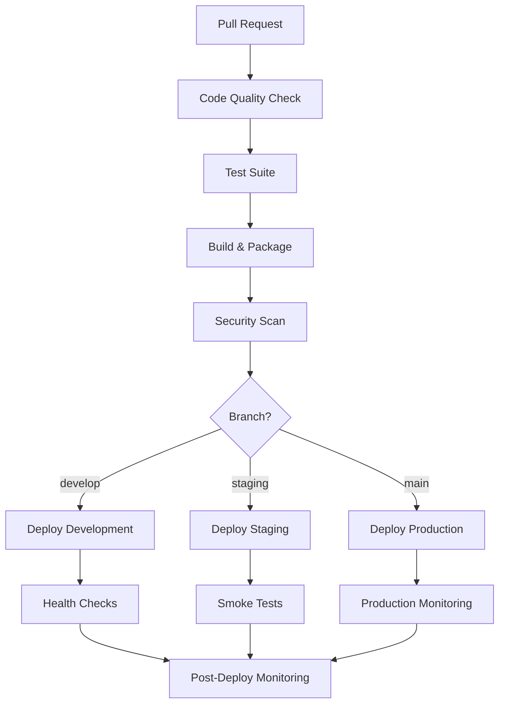

# 🚀 CI/CD Setup Guide

Este documento descreve o setup completo de CI/CD implementado para o Personal Financial Management API, seguindo as guidelines do development workflow.

## 📋 Visão Geral

O pipeline de CI/CD foi configurado para funcionar com três ambientes distintos:

- **Development** (`develop` branch) - Ambiente de desenvolvimento
- **Staging** (`staging` branch) - Ambiente de homologação/testes
- **Production** (`main` branch) - Ambiente de produção

## 🏗️ Arquitetura do Pipeline



## 📁 Estrutura de Arquivos

```
.github/
├── workflows/
│   ├── ci-cd.yml              # Pipeline principal
│   ├── staging-deploy.yml     # Deploy específico para staging
│   └── production-deploy.yml  # Deploy específico para produção
scripts/
├── deploy.sh                  # Script de deploy manual
└── monitor-deployment.sh      # Script de monitoramento
env.staging.example            # Configurações de staging
```

## 🔧 Workflows GitHub Actions

### 1. Pipeline Principal (`ci-cd.yml`)

**Trigger:**

- Pull Requests para `develop`, `staging`, `main`
- Push para `develop`, `staging`, `main`
- Dispatch manual

**Jobs:**

1. **Code Quality** - Linting, formatação, auditoria de segurança
2. **Test Suite** - Testes unitários, integração e E2E
3. **Build & Package** - Build da aplicação e criação de imagem Docker
4. **Security Scan** - Análise de vulnerabilidades com Trivy
5. **Deploy** - Deploy automático baseado na branch
6. **Post-Deployment** - Monitoramento pós-deploy

### 2. Deploy de Staging (`staging-deploy.yml`)

**Trigger:**

- Push para `staging`
- Dispatch manual com opção de force deploy

**Características:**

- Testes específicos para staging
- Migrations de banco de dados
- Smoke tests completos
- Health checks rigorosos

### 3. Deploy de Produção (`production-deploy.yml`)

**Trigger:**

- Push para `main`
- Dispatch manual com controles avançados

**Características:**

- Validações de segurança rigorosas
- Backup automático antes do deploy
- Testes de performance e carga
- Rollback automático em caso de falha
- Aprovação manual obrigatória

## 🌊 Fluxo de Desenvolvimento

### Branch Strategy

```
main (production)
├── staging (homologação)
├── develop (desenvolvimento)
└── feature/* (features individuais)
```

### Fluxo Completo

1. **Feature Development**

   ```bash
   git checkout develop
   git checkout -b feature/nova-funcionalidade
   # Desenvolvimento...
   git push origin feature/nova-funcionalidade
   ```

2. **Pull Request para Develop**

   - Cria PR da feature para `develop`
   - CI/CD executa quality checks e testes
   - Após merge, deploy automático para development

3. **Promoção para Staging**

   ```bash
   git checkout staging
   git merge develop
   git push origin staging
   ```

   - Deploy automático para staging
   - Testes de integração completos
   - QA testing

4. **Release para Produção**
   ```bash
   git checkout main
   git merge staging
   git push origin main
   ```
   - Aprovação manual necessária
   - Deploy com zero downtime
   - Monitoramento intensivo

## 🛠️ Scripts de Deploy

### Deploy Manual

```bash
# Deploy para desenvolvimento
./scripts/deploy.sh development

# Deploy para staging com versão específica
./scripts/deploy.sh staging --version=v1.2.3

# Deploy para produção (requer aprovação)
./scripts/deploy.sh production

# Deploy forçado (emergência)
./scripts/deploy.sh production --force --skip-tests

# Rollback
./scripts/deploy.sh production --rollback
```

### Monitoramento

```bash
# Monitorar produção por 10 minutos
./scripts/monitor-deployment.sh production --duration=600

# Monitorar todos os ambientes continuamente
./scripts/monitor-deployment.sh all --continuous

# Monitoramento detalhado
./scripts/monitor-deployment.sh staging --verbose
```

## 🔒 Configuração de Ambientes

### Variáveis de Ambiente

Cada ambiente possui suas próprias configurações:

- `env.dev.example` - Development
- `env.staging.example` - Staging
- `env.prod.example` - Production

### Secrets do GitHub

Configure os seguintes secrets no repositório:

```yaml
# Container Registry
GITHUB_TOKEN: # Automaticamente disponível

# Database
DATABASE_PASSWORD_DEV: # Senha do banco development
DATABASE_PASSWORD_STAGING: # Senha do banco staging
DATABASE_PASSWORD_PROD: # Senha do banco produção

# JWT
JWT_SECRET_DEV: # JWT secret development
JWT_SECRET_STAGING: # JWT secret staging
JWT_SECRET_PROD: # JWT secret produção

# Infraestrutura (quando implementada)
AWS_ACCESS_KEY_ID: # Credenciais AWS
AWS_SECRET_ACCESS_KEY: # Credenciais AWS
KUBE_CONFIG: # Configuração Kubernetes
```

## 📊 Monitoramento e Observabilidade

### Health Checks

Todos os ambientes possuem endpoints de health check:

- **Development:** `http://localhost:3000/api/v1/health`
- **Staging:** `https://staging.financial-app.com/api/v1/health`
- **Production:** `https://financial-app.com/api/v1/health`

### Métricas

Endpoints de métricas Prometheus:

- **Development:** `http://localhost:3000/api/v1/metrics`
- **Staging:** `https://staging.financial-app.com/api/v1/metrics`
- **Production:** `https://financial-app.com/api/v1/metrics`

### Logs

Os logs são coletados e armazenados em:

- `logs/combined.log` - Logs gerais
- `logs/error.log` - Logs de erro
- `logs/monitoring/` - Logs de monitoramento

## 🚨 Alertas e Notificações

### Configuração de Alertas

1. **Deployment Failures** - Falhas em qualquer ambiente
2. **Security Issues** - Vulnerabilidades encontradas
3. **Performance Degradation** - Degradação de performance
4. **Health Check Failures** - Falhas em health checks

### Canais de Notificação

- GitHub Issues (automáticas)
- Slack (quando configurado)
- Email (quando configurado)

## 🔄 Rollback e Recovery

### Rollback Automático

O sistema possui rollback automático em caso de:

- Health checks falhando por mais de 5 minutos
- Security scans bloqueando o deploy
- Métricas de performance degradadas

### Rollback Manual

```bash
# Rollback via script
./scripts/deploy.sh production --rollback

# Rollback via GitHub Actions
# Use o workflow dispatch com opção rollback=true
```

## 📈 Métricas de Performance

### Métricas Coletadas

- **Deployment Frequency** - Frequência de deploys
- **Lead Time** - Tempo do commit ao deploy
- **MTTR** - Tempo médio de recuperação
- **Change Failure Rate** - Taxa de falha de mudanças

### Dashboards

- Grafana dashboard para observabilidade
- GitHub Actions dashboard para pipeline metrics
- Custom dashboard para business metrics

## 🔧 Troubleshooting

### Problemas Comuns

1. **Deploy falha em staging**

   ```bash
   # Verificar logs
   ./scripts/monitor-deployment.sh staging --verbose

   # Forçar redeploy se necessário
   ./scripts/deploy.sh staging --force
   ```

2. **Tests falhando no CI**

   ```bash
   # Executar testes localmente
   npm run test
   npm run test:e2e

   # Verificar se banco de teste está limpo
   npm run migration:run
   ```

3. **Security scan bloqueando**

   ```bash
   # Verificar vulnerabilidades
   npm audit

   # Atualizar dependências
   npm update
   ```

4. **Production rollback necessário**
   ```bash
   # Rollback imediato
   ./scripts/deploy.sh production --rollback --skip-tests
   ```

### Logs Importantes

```bash
# Logs do pipeline
tail -f logs/combined.log

# Logs de erro
tail -f logs/error.log

# Logs de monitoramento
ls -la logs/monitoring/
```

## 🎯 Best Practices

### Para Desenvolvedores

1. **Sempre criar PRs** - Nunca push direto para branches principais
2. **Testes obrigatórios** - Nunca skippar testes sem justificativa
3. **Commit messages claros** - Seguir conventional commits
4. **Feature flags** - Para features experimentais

### Para DevOps

1. **Monitorar métricas** - Acompanhar performance do pipeline
2. **Backup regular** - Manter backups de produção atualizados
3. **Security updates** - Manter dependencies atualizadas
4. **Documentation** - Manter documentação atualizada

### Para QA

1. **Staging testing** - Usar staging para testes completos
2. **Smoke tests** - Executar smoke tests após cada deploy
3. **Performance validation** - Validar performance em staging
4. **Security testing** - Testes de segurança regulares

## 🚀 Próximos Passos

### Melhorias Planejadas

1. **Infraestrutura como Código**

   - Terraform para provisionamento
   - Kubernetes para orquestração

2. **Advanced Monitoring**

   - APM integration
   - Distributed tracing
   - Custom business metrics

3. **Security Enhancements**

   - SAST/DAST integration
   - Container signing
   - Compliance scanning

4. **Performance Optimization**
   - Caching strategies
   - CDN integration
   - Database optimization

### Roadmap

- **Q1 2025:** Cloud infrastructure setup
- **Q2 2025:** Advanced monitoring and alerting
- **Q3 2025:** Security hardening
- **Q4 2025:** Performance optimization

## 📞 Suporte

Para suporte com CI/CD:

1. **Issues:** Criar issue no GitHub com label `ci/cd`
2. **Documentation:** Consultar este documento
3. **Scripts:** Usar scripts de debugging disponíveis
4. **Monitoring:** Verificar dashboards de observabilidade

## 🧪 Configuração de Testes

### Cobertura de Testes

O projeto mantém **100% de cobertura de testes** com exclusões específicas para arquivos que não requerem testes:

#### Arquivos Excluídos da Cobertura

1. **Index.ts Files** - `src/**/index.ts`

   - **Justificativa:** São apenas pontos de re-export, não contêm lógica de negócio
   - **Configuração:** `'!src/**/index.ts'` no `jest.config.js`

2. **Migrations** - `src/infra/db/typeorm/migrations/**`

   - **Justificativa:** Scripts de schema de banco, testados através de testes de integração
   - **Configuração:** `'!src/infra/db/typeorm/migrations/**'` no `jest.config.js`

3. **Outros Arquivos Excluídos:**
   - Arquivos de configuração (`src/main.ts`, `src/**/*.module.ts`)
   - Estruturas de dados (`src/**/*.interface.ts`, `src/presentation/dtos/**`)
   - Factories e containers DI (`src/main/factories/**`)
   - Entidades TypeORM (`src/infra/db/typeorm/entities/**`)

### Pipeline de Testes no CI/CD

```yaml
# Testes no GitHub Actions
test:
  name: 🧪 Test Suite
  runs-on: ubuntu-latest

  services:
    postgres:
      image: postgres:15-alpine
      env:
        POSTGRES_PASSWORD: postgres
        POSTGRES_USER: postgres
        POSTGRES_DB: financial_db_test
      options: >-
        --health-cmd pg_isready
        --health-interval 10s
        --health-timeout 5s
        --health-retries 5
      ports:
        - 5432:5432

  steps:
    - name: 🧪 Run unit tests
      run: yarn test --passWithNoTests

    - name: 📊 Run test coverage
      run: yarn test:cov --passWithNoTests

    - name: 🔍 Run E2E tests
      run: yarn test:e2e --passWithNoTests

    - name: 📈 Upload coverage reports
      uses: codecov/codecov-action@v3
      with:
        file: ./coverage/lcov.info
        flags: unittests
        name: codecov-umbrella
        fail_ci_if_error: false
```

### Comandos de Teste

```bash
# Desenvolvimento local
yarn test                    # Testes unitários
yarn test:cov               # Cobertura de testes
yarn test:e2e               # Testes E2E
yarn test:watch             # Modo watch

# CI/CD
yarn test --passWithNoTests --ci  # Testes no CI
```

### Validação de Cobertura

A pipeline **falha** se:

- Cobertura de branches < 100%
- Cobertura de functions < 100%
- Cobertura de lines < 100%
- Cobertura de statements < 100%

### Atualizando Exclusões de Cobertura

Para adicionar novos arquivos às exclusões:

1. **Edite** `jest.config.js`:

   ```javascript
   collectCoverageFrom: [
     'src/**/*.(t|j)s',
     '!src/novo-arquivo/**', // Justificativa da exclusão
   ],
   ```

2. **Documente** em `docs/TESTING_GUIDELINES.md`

3. **Teste** localmente:

   ```bash
   yarn test:cov
   ```

4. **Valide** no CI/CD através do PR

### Debugging de Testes no CI

```bash
# Logs de teste
gh run view --log

# Rerun apenas os testes
gh workflow run ci-cd.yml --ref feature/branch-name

# Verificar cobertura local
open ./coverage/lcov-report/index.html
```

📋 **Referências:**

- [Testing Guidelines](../requirements/guidelines/testing-requirements.md) - Diretrizes completas de teste
- [Jest Configuration](../jest.config.js) - Configuração do Jest

---

**Última atualização:** $(date '+%Y-%m-%d')
**Versão:** 1.0.0
**Maintainer:** DevOps Team
